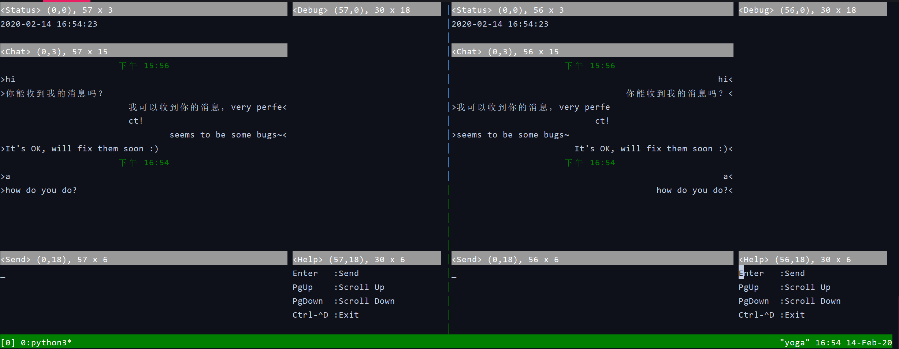
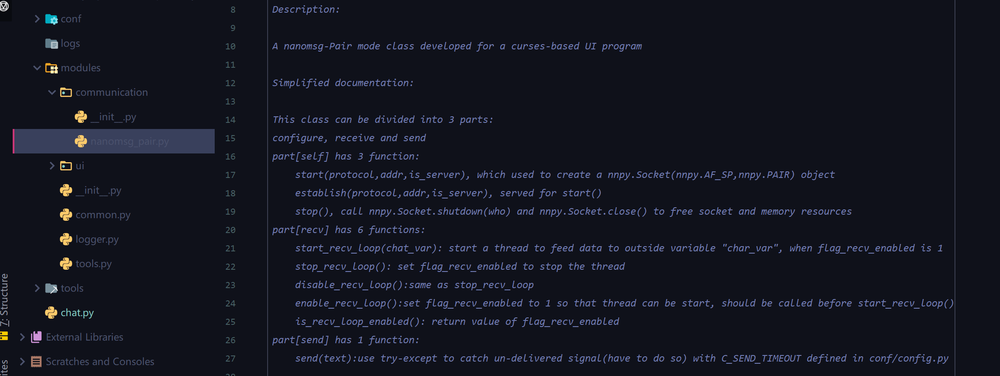
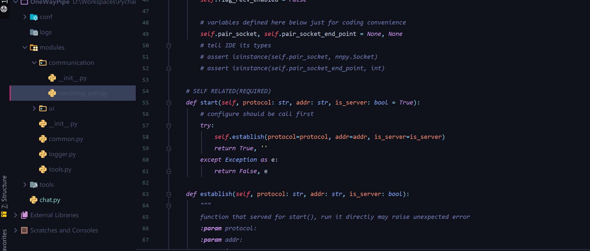
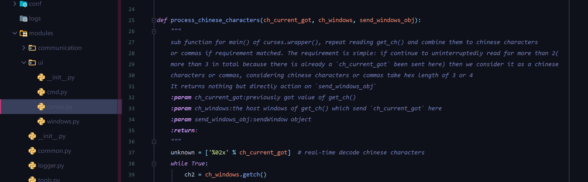

# nano-chat program

### Structure

.
├── [2.4K]  chat.py
├── [4.0K]  conf
│   └── [2.6K]  config.py
├── [4.0K]  logs
├── [4.0K]  modules
│   ├── [ 966]  common.py
│   ├── [4.0K]  communication
│   │   ├── [ 122]  \_\_init\_\_.py
│   │   └── [5.2K]  nanomsg_pair.py
│   ├── [ 121]  \_\_init\_\_.py
│   ├── [2.5K]  logger.py
│   ├── [1.3K]  tools.py
│   └── [4.0K]  ui
│       ├── [ 576]  cmd.py
│       ├── [10.0K]  curses.py
│       ├── [ 122]  \_\_init\_\_.py
│       └── [ 23K]  windows.py
└── [4.0K]  tools
    ├── [ 241]  curses_demo_client.py
    ├── [ 241]  curses_demo_server.py
    └── [ 364]  find_key_name.py

6 directories, 15 files

### Requirements

1. python3+
2. nnpy
3. curses
4. linux or WSL(windows subsystem of linux)

### Easy Run

run as server node:

`python3 chat.py bind tcp *:4000 ` or `python3 chat.py bind`

run as client node:

`python3 chat.py connect tcp 127.0.0.1:4000` or `python3 chat.py connect`

### Documentation

There is a summary table of the program structure,  but if you want all details I suggest that you can refer to exact script file and read the comments for all details that I left:

| 名称            | 位置                       | 类型      | 说明                                                         |
| --------------- | -------------------------- | --------- | ------------------------------------------------------------ |
| chat.py         | .                          | file      | 入口代码：提供命令行子命令选项与用户交互，而后进入curses交互 |
| conf            | .                          | directory | 配置目录：存放配置文件（默认为config.py）                    |
| modules         | .                          | directory | 模块目录：存放通信、界面显示和日志记录等模块代码，用于调用   |
| tools           | .                          | directory | 工具目录：存放用于测试的一键运行脚本，比如获取按键ASCII及其curses按键名等 |
| logs            | .                          | directory | 日志保存目录：用于早期版本，近期版本因为引入了curses暂时未集成logger模块，故logs目录为空，暂无实际使用意义。 |
|                 |                            |           |                                                              |
| config.py       | ./conf                     | file      | 默认配置文件，各常量均以大写命名，具有可读性，如：C_SHOW_POSITION_SIZE = True，C表示给curses相关函数使用，SHOW_POSITION_SIZE代表是否在窗口栏显示定位坐标和窗口大小。 |
|                 |                            |           |                                                              |
| common.py       | ./modules                  | file      | 通用模块。 函数： **cn_count**() **current_datetime**() |
| logger.py       | ./modules                  | file      | 日志记录模块，用于同时记录日志到本地文件和终端。 类：**Logger** |
| tools.py        | ./modules                  | file      | 工具函数模块，放置了tools下脚本需要用到的函数。 函数： **print_key_name**() **curses_ui_test_server**() **curses_ui_test_client**() |
| ui              | ./modules                  | directory | 界面显示子模块目录。                                         |
| communication   | ./modules                  | directory | 通信子模块目录。                                             |
| cmd.py          | ./modules/ui               | file      | 子命令模块，包含两个子命令的调用函数。 函数： **sub_cmd_bind**() **sub_cmd_connect**() |
| windows.py      | ./moudles/ui               | file      | 窗口模块，用于创建curses窗口布局，移除了原生curses坐标系统先y后x的反人类设定，更加易于使用。 类： **CreateWindow** **StatusWindow** **ChatWindow** **SendWindow** **DebugWindow** **HelpWindow** |
| curses.py       | ./modules/ui               | file      | curses启动模块，用于辅助启动curses。 函数： **process_chinese_characters**() **color_pair_configure**() **pre_configure**() **key_pressed_solution**() **main4curses_wrapper**() **boot_loader4curses**() |
| nanomsg_pair.py | ./module/ communication | file      | nanomsg(pair)通信模块，用于实际执行网络数据通信，优化了原生C-nanomsg的蜜汁报错，提高执行效率。 类： **PairObject** |
